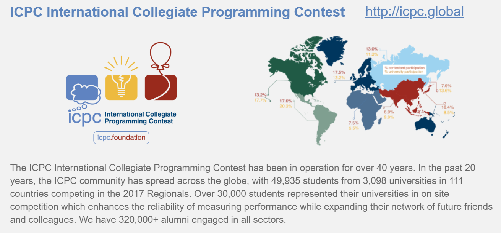

# Accept

## 基础

[递归&分治](conquer.md)&emsp;
[排序](sort.md)&emsp;
[二分](binary.md)&emsp;
[三分](three_points.md)&emsp;
[前缀和](prefix_sum.md)&emsp;
[差分](difference.md)&emsp;

## 搜索

[DFS](dfs.md)&emsp;
[BFS](bfs.md)&emsp;
[双向搜索](bidirectional.md)&emsp;
[启发式搜索](heuristic.md)&emsp;
[A\*](astar.md)&emsp;
[迭代加深搜索](iterative.md)&emsp;
[IDA\*](idastar.md)&emsp;
[回溯法](backtracking.md)&emsp;
[舞蹈链](dancing_links.md)&emsp;

## 动态规划

[记忆化搜索](memo.md)&emsp;
[背包DP](pack_dp.md)&emsp;
[区间DP]()&emsp;
[DAG上的DP]()&emsp;
[树形DP]()&emsp;
[状压DP]()&emsp;
[数位DP](number.md)&emsp;
[插头DP]()&emsp;
[计数DP]()&emsp;
[动态DP]()&emsp;
[DP优化]()&emsp;
[其它DP方法]()&emsp;

## 字符串

[字典树](trie.md)&emsp;
[01字典树](01trie.md)&emsp;
[KMP](kmp.md)&emsp;
[扩展KMP](exkmp.md)&emsp;
[AC自动机](ac_automaton.md)&emsp;
[马拉车](manacher.md)&emsp;

## 数学

[最大公约数](gcd.md)&emsp;
[最小公倍数](lcm.md)&emsp;
[扩展欧几里得](exgcd.md)&emsp;
[快速幂](quick_pow.md)&emsp;

## 数据结构

[ST表&RMQ](rmq.md)&emsp;
[二维RMQ](rmq2.md)&emsp;
[树状数组]()&emsp;
[并查集]()&emsp;
[单调栈]()&emsp;
[单调队列]()&emsp;
[线段树]()&emsp;

## 图论

[拓扑排序]()&emsp;
[最短路]()&emsp;
[最小生成树]()&emsp;
[强连通分量]()&emsp;
[二分图]()&emsp;
[网络流]()&emsp;

## 计算几何

## 专题

## 杂项

[__int128](int128.md)&emsp;
[队列情况及定义排序规则]()&emsp;

## Test

[test](test.md)&emsp;

**模板为个人代码风格，仅供他人参考**
